<p align="center">
  <picture>
    <source media="(prefers-color-scheme: dark)" srcset="docs/images/logo-dark.png">
    
  </picture>
</p>

<br>

## 프로젝트 소개

Spring MVC 기반의 판매·재고 관리 ERP 팀 프로젝트입니다.
기초등록, 견적, 주문, 판매, 출하지시, 출하, 재고 업무를 다룹니다.

### 업무 흐름

<p align="center">
  <picture>
    <source media="(prefers-color-scheme: dark)" srcset="docs/images/flow-dark.png">
    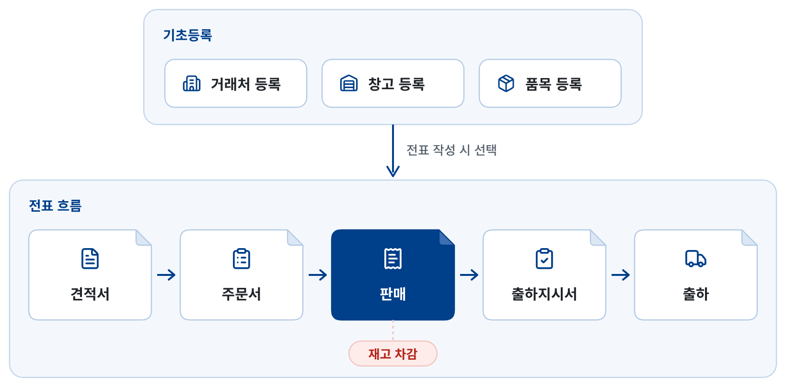
  </picture>
</p>

<br>

## 기술 스택

| 구분 | 기술 |
| --- | --- |
| 백엔드 | 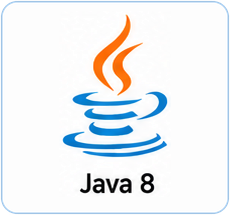 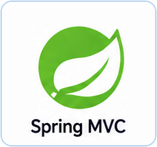 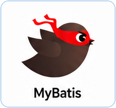 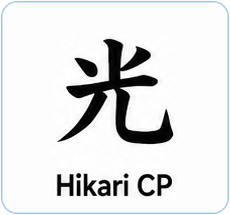 |
| 화면 | 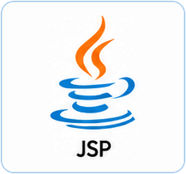 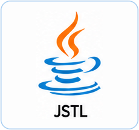    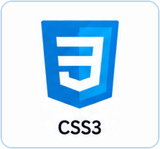 |
| DB | 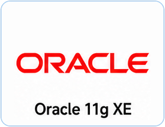 |
| 개발·배포 | 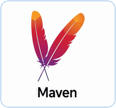 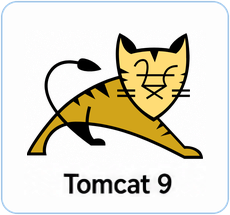 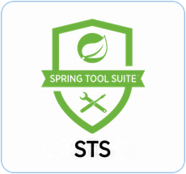 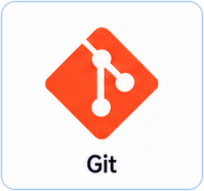  |

<details>
<summary>버전 정보</summary>
<br>

| 구분 | 기술 |
| --- | --- |
| 백엔드 | Java 8, Spring MVC 5.0.7, MyBatis 3.4.6, HikariCP 2.7.4 |
| 화면 | JSP / JSTL, jQuery 3.7.1 |
| DB | Oracle 11g XE |
| 개발·배포 | Maven WAR, Tomcat 9, Eclipse / STS, Git / GitHub |

</details>

<br>

## Branch 컨벤션

```
main: 최종 배포 버전
dev: 개발 통합 브랜치 (다음 배포 준비)
feature/기능명: 기능 구현 (예: feature/partner)
```

<br>

## 기능별 브랜치

| 기능 | 브랜치 |
| ----------- | ------------------------------- |
| 거래처 등록 | `feature/partner` |
| 창고 등록 | `feature/warehouse` |
| 품목 등록 | `feature/item` |
| 견적서 입력 | `feature/quotation-input` |
| 견적서 조회 | `feature/quotation-list` |
| 견적서 현황 | `feature/quotation-status` |
| 미주문 현황 | `feature/quotation-unordered` |
| 주문서 입력 | `feature/salesorder-input` |
| 주문서 조회 | `feature/salesorder-list` |
| 주문서 현황 | `feature/salesorder-status` |
| 미판매 현황 | `feature/salesorder-unsold` |
| 판매 입력 | `feature/sale-input` |
| 판매 조회 | `feature/sale-list` |
| 판매 현황 | `feature/sale-status` |
| 판매 단가 일괄 변경 | `feature/sale-bulk-price` |
| 출하지시서 입력 | `feature/shipinstruction-input` |
| 출하지시서 조회 | `feature/shipinstruction-list` |
| 출하 입력 | `feature/shipment-input` |
| 출하 조회 | `feature/shipment-list` |

<br>

## 기능 개발 시작 방법

1. `dev` 브랜치로 이동합니다.
2. `dev` 브랜치를 최신 상태로 Pull 합니다.
3. `dev`에서 자신의 `feature/기능명` 브랜치를 생성합니다.
4. 기능 개발 후 Commit 및 Push 합니다.
5. GitHub에서 `feature/기능명 → dev` Pull Request를 생성합니다.
6. Merge가 끝난 후 다음 기능은 다시 최신 `dev`에서 새 브랜치를 만들어 시작합니다.

<br>

## PR 컨벤션

PR 제목은 Commit 메시지와 동일하게 `type: subject` 형식으로 작성합니다.

예시

```text
feat: 견적서 입력 기능 구현
fix: 판매 단가 계산 오류 수정
```
<br>

## Commit 컨벤션

```
type: subject

body (선택)
```

예시

```
feat: 견적서 입력 화면 구현

- 견적서 저장 기능 추가
- 품목 선택 시 단가 자동 입력
```

<br>

### type

| type | 언제 쓰나요 |
| --- | --- |
| feat | 새 기능 추가 |
| fix | 버그 수정 |
| refactor | 기능 변화 없이 코드 정리 |
| style | 공백, 들여쓰기 등 포맷만 변경 |
| docs | README 등 문서 수정 |
| chore | 설정, 라이브러리 추가 등 기타 작업 |

* 여러 작업이 섞이면 가장 중요한 type 하나만 쓴다.

### subject

* 무엇을 했는지 간단하게 작성한다.
* 끝에 마침표를 붙이지 않는다.

### body (선택)

* 필요할 때만 쓰고, 각 줄은 `-`로 시작한다.
